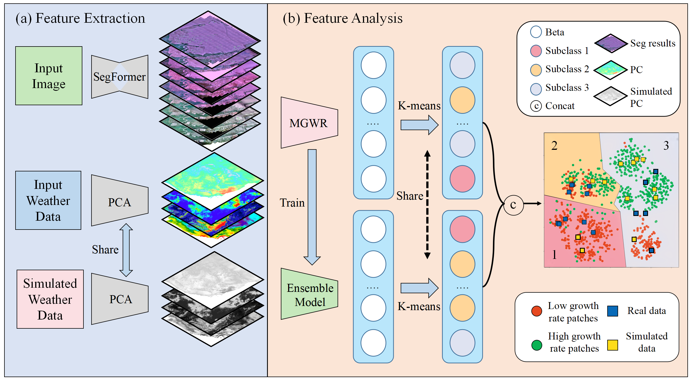

# ai4FastEvolution
An official implement of Uncovering the Hidden Consequences of Rapid Adaptation in Invasive Plants via a Deep Learning Approach



## Environment Setup

To set up the required environment, you can choose from the following options:

- **Using pip**:
  You can install the necessary Python dependencies from the `requirements.txt` file using the following command:

  ```bash
  pip install -r requirements.txt

We highly recommend using Docker to set up the required environment. Two Docker images are available for your convenience:

- **Using Docker from ali cloud**:
  - [**registry.cn-hangzhou.aliyuncs.com/cyd_dl/monai-vit:v26**](https://registry.cn-hangzhou.aliyuncs.com/cyd_dl/monai-vit:v26)
  
  ```bash
  docker pull registry.cn-hangzhou.aliyuncs.com/cyd_dl/monai-vit:v26
  
- **Using docker from dockerhub**:
  - [**cyd_docker:v1**](https://ydchen0806/cyd_docker:v1)
  
  ```bash
  docker pull ydchen0806/cyd_docker:v1

## Contents

- **/code** - Contains all runnable code.

- **/raw_data** - Contains original UAV imagery data and weather station data.

- **/weather_data_1005** - Contains two climate datasets:
  - [ERA5-Land hourly data](https://cds.climate.copernicus.eu/cdsapp#!/dataset/reanalysis-era5-land?tab=form) - Hourly surface reanalysis data.
  - [Precipitation monthly and daily gridded data](https://cds.climate.copernicus.eu/cdsapp#!/dataset/satellite-precipitation?tab=form) - Monthly and daily gridded precipitation data.
  - [China weather station data](https://data.cma.cn/). - Weather data from the Chinese government.

## Code

Here is a list of the code files in this repository:

- `data_preprocess_more_data.py` - Generates the initial dataset.
- `get_weather_data.py` - Incorporates weather data.
- `get_growth_area.py` - Calculates lesion distances.
- `data_pca.py` - Reduces dimensionality via PCA.
- `MGWR.py` - Fits a geographically weighted regression model to estimate beta.(Update soon)
- `auto_ml_fit.py` - Fits lesion growth rates using machine learning.
- `get_cluster.py` - Performs clustering on the final results.

## Workflow Overview

The overall workflow can be summarized as follows:

1. `data_preprocess_more_data.py` generates the initial dataset.
2. `get_weather_data.py` incorporates weather data.
3. `get_growth_area.py` calculates lesion distances.
4. `data_pca.py` reduces dimensionality via PCA.
5. Use [MGWR](https://sgsup.asu.edu/sparc/multiscale-gwr) to fit a geographically weighted regression to estimate beta.
6. `auto_ml_fit.py` fits lesion growth rates using machine learning.
7. `get_cluster.py` clusters the final results.

This workflow provides a high-level overview of the steps involved in your codebase.
